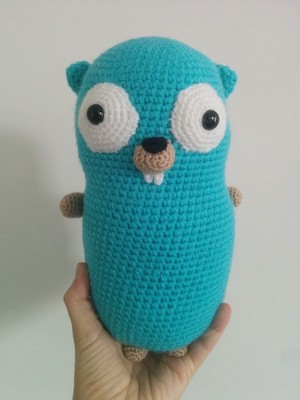
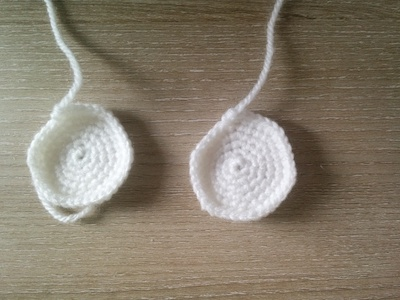
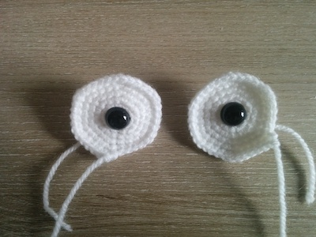
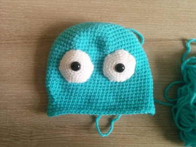
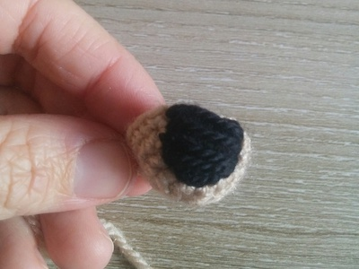
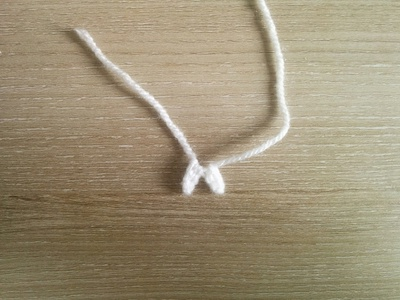
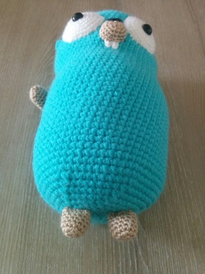
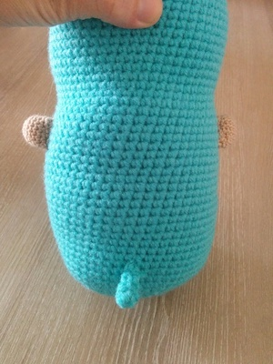

# Patrón Amigurumi de Go Gopher



## Necesitarás

* **Hilo:** Turquesa *(aran)*, blanco, marrón, negro *(DK - Hilo fino-medio)*
* **Ganchillos:** 2,5 para el cuerpo y orejas; 2 or 2,25 para los otros detalles
* Un par de ojos de seguridad de 12 mm
* Relleno
* Aguja
* Marcador de puntos
* Tijeras

## Abreviaciones

```
sc = punto bajo
ch = cadena
inc = aumento, hacer dos puntos en un punto
dec = disminución, hacer dos puntos en un punto
even = punto bajo en cada punto
fo = terminación
```

## Globo ocular



```
Hacer dos utilizando hilo blanco

1. 6 en un circulo mágico   (6)
2. (inc)x6                  (12)
3. (sc, inc)x6              (18)
4. (2 sc, inc)x6            (24)
5. (3 sc, inc)x6            (30)
6. (4 sc, inc)x6            (36)
fo, dejar un hilo largo

Ponga los ojos de seguridad en el centro de los globos oculares.
```


## Cuerpo


```
Utilizar hilo aran color turquesa

1. 6 en un circulo mágico             (6)
2. (inc)x6                            (12)
3. (sc, inc)x6                        (18)
4. (2 sc, inc)x6                      (24)
5. (3 sc, inc)x6                      (30)
6. (4 sc, inc)x6                      (36)
7. (5 sc, inc)x6                      (42)
8. (6 sc, inc)x6                      (48)
9. (7 sc, inc)x6                      (54)
10. (8 sc, inc)x6                     (60)
11-25. even                           (60)
26. 14 sc, dec, 28 sc, dec, 14 sc     (58)
27. 14 sc, dec, 27 sc, dec, 13 sc     (56)
28. 14 sc, dec, 26 sc, dec, 12 sc     (54)
29. even                              (54)
30. 13 sc, inc, 26 sc, inc, 13 sc     (56)
31. 14 sc, inc, 26 sc, inc, 14 sc     (58)
32. 15 sc, inc, 26 sc, inc, 15 sc     (60)
```

```
Colocar los ojos dejando 13 filas vacías desde la parte superior de la cabeza.
Si desea hacer los ojos saltones, use un poco de relleno para los ojos.
```



```
33-53. even                     (60)

Comenzar a rellenar el cuerpo.

54. (8 sc, dec)x6               (54)
55. (7 sc, dec)x6               (48)
56. (6 sc, dec)x6               (42)
57. (5 sc, dec)x6               (36)
58. (4 sc, dec)x6               (30)
59. (3 sc, dec)x6               (24)
60. (2 sc, dec)x6               (18)
61. (1 sc, dec)x6               (12)
62. (dec)x6                     (6)
fo, cerrar el cuerpo.
```

## Oreja

```
Hacer dos utilizando hilo aran

1. 4 en un circulo mágico       (4)
2. (inc)x4                      (8)
3. (sc, inc)x4                  (12)
4. even                         (12)
fo, dejar un hilo largo

Coser las orejas a la cabeza (dejando alrededor de 9 filas desde la parte superior de la cabeza).
```

## Boca



```
Utilizar marrón

1. 6 en unu circulo mágico      (6)
2. (inc)x6                      (12)
3. (sc, inc)x6                  (18)
4-5. even                       (18)
fo, dejar un hilo largo

Borde la parte superior con hilo negro.
```

## Dientes



```
Utilizar blanco

Haga una cadena de 4 sc, comience en la segunda puntada de la cadena y regrese al principio.
Haga otra cadena de 4 sc, regrese de la misma manera.

Coser los dientes al lugar apropiado, luego coser la boca en su lugar.
```

## Patas



```
Hacer cuatro utilizando hilo marrón

1. 6 en un circulo mágico       (6)
2. (inc)x6                      (12)
3-7. even                       (12)
fo, dejar un hilo largo

Coser las patas al cuerpo.
```

## Cola



```
Utilizar aran

1. 4 en un cirulo mágico        (4)
2.-4. even                      (4)
fo, dejar un hilo largo

Coser la cola al cuerpo.
```

¡Bien hecho, tu Gopher está listo! 😁👏
